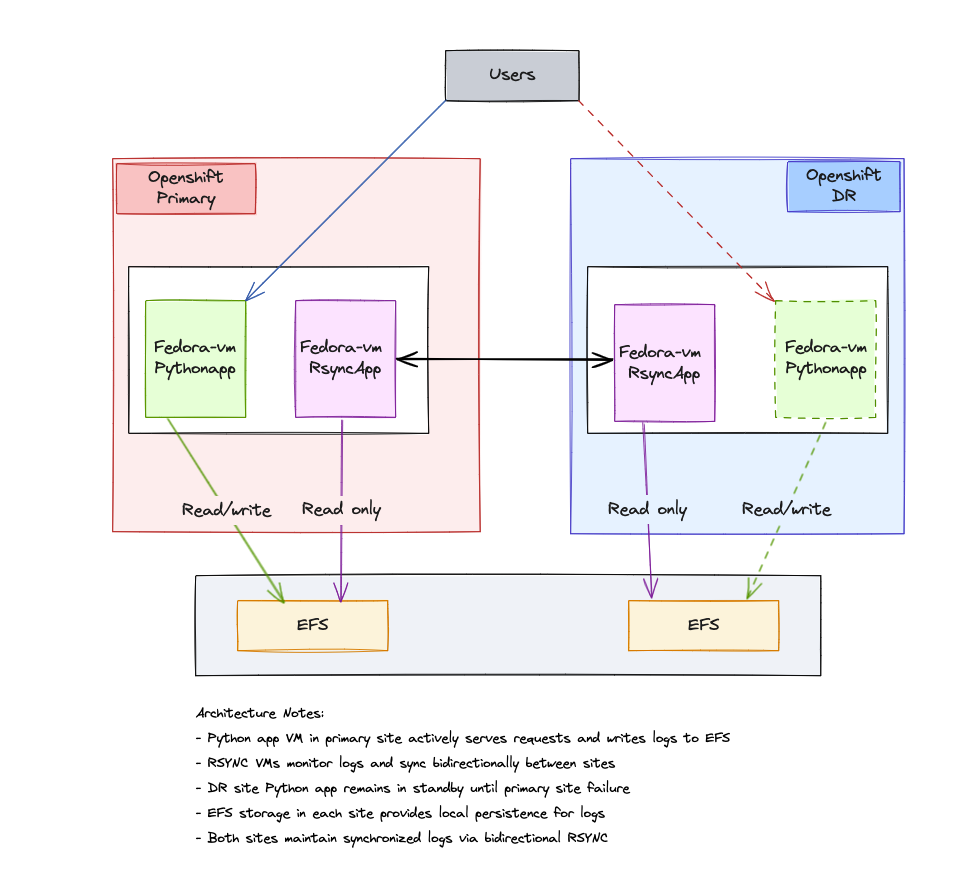

# 🚀 KubeVirt GitOps

<div align="center">

[](https://opensource.org/licenses/Apache-2.0)
[](https://www.openshift.com/)
[](https://argoproj.github.io/cd/)


**A GitOps approach to managing KubeVirt virtualization on OpenShift clusters**

</div>

---

## 📋 Overview

This repository contains automation scripts and configuration for setting up a GitOps workflow using Argo CD (OpenShift GitOps) to manage KubeVirt resources. The project provides a declarative approach to managing virtual machines and related resources on OpenShift.

## ✅ Prerequisites

- An OpenShift cluster 4.10+ with cluster-admin access
- `oc` command-line tool installed and configured
- Basic understanding of GitOps principles and Argo CD

## 🚦 Quick Start

### 1. Install Argo CD (OpenShift GitOps)

Run the installation script:

```bash
# Make the script executable
chmod +x install-argo.sh

# Run the script
./install-argo.sh
```

## 🔒 How to use private git repo with ArgoCD

If your repo is private, run the following command to add the GitHub token to ArgoCD:

```bash
SERVER_URL=$(oc get routes openshift-gitops-server -n openshift-gitops -o jsonpath='{.status.ingress[0].host}')
ADMIN_PASSWD=$(oc get secret openshift-gitops-cluster -n openshift-gitops -o jsonpath='{.data.admin\.password}' | base64 -d)
argocd login --username admin --password ${ADMIN_PASSWD} ${SERVER_URL} --grpc-web
argocd repo add https://github.com/rmallam/kubevirt-gitops --username rmallam --password gitpat #replace this with the right git token
```

## 📦 Install Operator

Apply the infra-appset.yaml to deploy operators:

```bash
oc apply -f argo-apps/infra-appset.yaml
```

## 📝 Additional Notes for AWS Virtualization

### ROSA (Red Hat OpenShift Service on AWS)

Adding a baremetal machinepool for ROSA to run virtualization workloads:

```bash
rosa create machinepools -c $(rosa list clusters | awk -F " " '{print $2}' | grep -v NAME) --instance-type c6i.metal --name virt-pool --replicas 3
```

### EFS (Elastic File System)

Create an EFS filesystem named "pythontest" using the AWS CLI:

```bash
# Get your VPC ID where the ROSA cluster is running
VPC_ID=$(aws ec2 describe-vpcs --filters "Name=tag:Name,Values=*rosa*" --query "Vpcs[0].VpcId" --output text)

# Create a security group for the EFS filesystem
SECURITY_GROUP_ID=$(aws ec2 create-security-group \
  --group-name EFS-pythontest-SG \
  --description "Security group for EFS pythontest" \
  --vpc-id $VPC_ID \
  --output text --query 'GroupId')

# Allow inbound NFS traffic from anywhere
aws ec2 authorize-security-group-ingress \
  --group-id $SECURITY_GROUP_ID \
  --protocol tcp \
  --port 2049 \
  --cidr 0.0.0.0/0

# Create the EFS filesystem
EFS_ID=$(aws efs create-file-system \
  --creation-token pythontest \
  --tags Key=Name,Value=pythontest \
  --encrypted \
  --performance-mode generalPurpose \
  --throughput-mode bursting \
  --output text --query 'FileSystemId')

echo "Created EFS filesystem with ID: $EFS_ID"

# Create mount targets in all subnets of the VPC
for SUBNET_ID in $(aws ec2 describe-subnets --filters "Name=vpc-id,Values=$VPC_ID" --query "Subnets[*].SubnetId" --output text); do
  aws efs create-mount-target \
    --file-system-id $EFS_ID \
    --subnet-id $SUBNET_ID \
    --security-groups $SECURITY_GROUP_ID
done

echo "EFS filesystem 'pythontest' ($EFS_ID) has been created and configured."
```

Use this EFS filesystem with the same VPC as your ROSA cluster. The security group is configured to accept connections from anywhere, which is convenient for testing but should be restricted in production environments.

## 🏷️ Node Labeling for Disaster Recovery

Choose one or more nodes for DR sites and label them as DR:

```bash
oc label node ip-10-0-47-96.us-east-2.compute.internal site=dr
```

Choose one or more nodes for primary sites and label them as primary:

```bash
oc label node ip-10-0-47-116.us-east-2.compute.internal site=primary
```

copy from primary to DR

```
ssh pydev@aacb75bd6fea848cc875fd8e873f7b04-237625449.us-east-2.elb.amazonaws.com "rsync -avz --timeout=10 /opt/efs/logs/requests.log pydev@a60e637e82e874d6b93c2ccb9056ad92-433074728.us-east-2.elb.amazonaws.com:/opt/efs/logs/"
```

## 🔄  Architecture Overview  - Stretch Cluster Deployment

This repository provides configurations for deploying VMs in a stretch cluster configuration, where VMs are specifically placed on nodes in primary or DR sites using node selectors.

### Node Labeling for Stretch Clusters

Before deploying VMs, ensure your nodes are properly labeled to indicate their site affinity:

```bash
# Label nodes for primary site
oc label node <primary-node-name> site=primary

# Label nodes for DR site
oc label node <dr-node-name> site=dr
```

### Stretch Cluster Helm Chart

The `stretchtest` Helm chart is designed specifically for stretch cluster deployments:

```bash
# Deploy the stretch cluster ApplicationSet
oc apply -f argo-apps/stretch-virtualmachines-appset.yaml
```

This will create argo apps to deploy VMs to both primary and DR sites using the appropriate values files.

### Sample Values Files

The following values files demonstrate how to use nodeSelectors to target specific sites:

#### Primary Site Configuration (values.yaml)

```yaml
# VM Configuration for Primary Site
vmName: python-app-primary
image: fedora
cores: 2
memory: 4Gi
size: 30Gi
nodeSelector:
  site: primary
```

#### DR Site Configuration (values-dr.yaml)

```yaml
# VM Configuration for DR Site
vmName: python-app-dr
image: fedora
cores: 1
memory: 2Gi
size: 30Gi
nodeSelector:
  site: dr
standbyMode: true  # Indicates this is a standby VM
```

### Using NodeSelectors in VM Templates

The VM templates in the Helm chart use these nodeSelector values to ensure VMs are scheduled on the appropriate nodes:

```yaml
apiVersion: kubevirt.io/v1
kind: VirtualMachine
metadata:
  name: {{ .Values.vmName }}
spec:
  running: true
  template:
    spec:
      domain:
        // ...VM specs...
      nodeSelector:
{{ toYaml .Values.nodeSelector | indent 8 }}
```

This approach allows for a clear separation between primary and DR site VMs, making it easier to manage and maintain a resilient architecture.

## Architecture Overview  - Split cluster

The following diagram illustrates the cluster architecture with bidirectional rsync between primary and DR sites in a two cluster scenario:



### Key Components

- **Python Application VMs**: Fedora VMs running Python applications
  - Primary site: Active application serving requests
  - DR site: Standby application that activates when primary is down

- **RSYNC Service VMs**: Dedicated VMs that handle log synchronization
  - Monitor log files using inotify for real-time change detection
  - Bidirectional synchronization ensures both sites have updated logs
  - Conflict resolution to handle concurrent writes

- **External EFS Storage**: Provides persistent storage for logs
  - Each site has its own EFS storage
  - Logs written to EFS are synchronized between sites

## Directory Structure

- `/argo-apps`: ArgoCD ApplicationSet configurations
- `/virtualmachines`: Helm charts for different VM configurations
  - `/virtualmachines/rsyncapp`: Bidirectional rsync VM configuration
  - `/virtualmachines/stretchtest`: Stretched application testing environment

## Deployment Methods

The VMs can be deployed using ArgoCD ApplicationSets. For example, to deploy the stretch cluster configuration:

```bash
kubectl apply -f argo-apps/stretch-virtualmachines-appset.yaml
```

This will deploy both primary and DR site VMs with different configurations based on their respective values files.

## How Bidirectional Sync Works

1. Python apps write logs to local EFS storage
2. RSYNC VMs monitor log files for changes
3. When changes are detected, logs are synchronized to the remote site
4. Both sites maintain merged, deduplicated copies of all logs
5. DR site can take over operations with all historical logs available

## Configuring EFS Mounts

EFS storage is mounted at VM startup via cloud-init configurations. See `virtualmachines/rsyncapp/templates/cloud-init.yaml` for details.
**primary** : sudo mount -t nfs -o nfsvers=4.1,rsize=1048576,wsize=1048576,hard,timeo=600,retrans=2,noresvport 10.0.163.16:/ /opt/efs
**secondary** : sudo mount -t nfs -o nfsvers=4.1,rsize=1048576,wsize=1048576,hard,timeo=600,retrans=2,noresvport 10.0.57.188:/ /opt/efs
---

<div align="center">
<p>Made with ❤️ for the OpenShift & KubeVirt community</p>
</div>